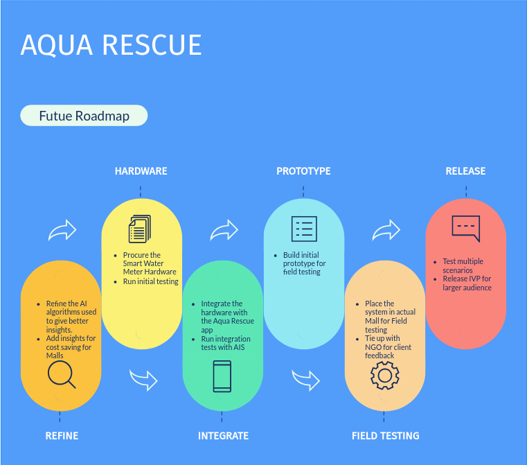

# Aqua Rescue


Aqua Rescue is an innovative application designed to address three critical aspects of water management in malls: identifying water leaks, estimating the availability of reusable water and incorporating rainfall analysis feature to facilitate rainwater harvesting in malls thereby further reducing their dependency on external water sources and promoting sustainability. With a focus on sustainability and aiding NGOs in their initiatives to ensure availability and sustainable management of water and sanitation for all, this application offers real-time monitoring, alerts, and data analysis to help conserve water resources.

[](https://www.apache.org/licenses/LICENSE-2.0) [](https://developer.ibm.com/callforcode/solutions/projects/get-started/)

- [Project summary](#project-summary)
  - [The issue we are hoping to solve](#the-issue-we-are-hoping-to-solve)
  - [How our technology solution can help](#how-our-technology-solution-can-help)
  - [Our idea](#our-idea)
- [Technology implementation](#technology-implementation)
  - [IBM AI service(s) used](#ibm-ai-services-used)
  - [Other IBM technology used](#other-ibm-technology-used)
  - [Solution architecture](#solution-architecture)
- [Presentation materials](#presentation-materials)
  - [Solution demo video](#solution-demo-video)
  - [Project development roadmap](#project-development-roadmap)
- [Additional details](#additional-details)
  - [How to run the project](#how-to-run-the-project)

## Project summary

### The issue we are hoping to solve

In a world surrounded by technologies and great progress in Clean water and sanitation, billions of people still lack access to safe drinking water, sanitation and hygiene.
As of today, 2.4 billions of people live in water stressed countries.
A lack of both cross-sector coordination over water and operational arrangements for transboundary water cooperation threatens the achievement of Sustainable Development Goals. When we speak about transboundary water cooperation, let us not limit ourselves to only the regional boundaries, but also cross functional boundaries.

### How our technology solution can help

Thanks to our Aqua Rescue app for the Malls and the NGOs, we will be able to increase access to water in urban areas with the support of cross sector operational arrangements.

### Our idea

Aqua Rescue is an innovative application designed to address three critical aspects of water management in malls: identifying water leaks, estimating the availability of reusable water and incorporating rainfall analysis feature to facilitate rainwater harvesting in malls thereby further reducing their dependency on external water sources and promoting sustainability. With a focus on sustainability and aiding NGOs in their initiatives to ensure availability and sustainable management of water and sanitation for all, this application offers real-time monitoring, alerts, and data analysis to help conserve water resources.

More detail is available in our [description document](./docs/DESCRIPTION.md).

## Technology implementation

### IBM AI service(s) used

- [Watson Machine Learning](https://cloud.ibm.com/catalog/services/watson-machine-learning) - IBM Watson Machine Learning is used by our AIS to give predective capabilities to the application by providing insights on Water scracity in the area, Rain harvesting insights, and Event tracking of NGOs and providing water reservation insights.

### Solution architecture

Diagram and step-by-step description of the flow of our solution:


#### Mall App
1. The Mall Personnel navigates to the dashboard.
2. The Dashboard shows following information:
  - Water consumption statistics
  - Ongoing leaks if any
  - Retreated water Statistics
  - Rainwater harvesting insights
3. The Mall Personnel can act upon the leaks in timely manner to mitigate water wastage.
4. The Mall Personnel can take necessary actions based upon the insights provided.

#### NGO App
1. The NGO Personnel navigates to the dashboard.
2. The dashboard lists the nearby Malls where water is available for reservation.
3. Based on the needs the NGO can reserve the water.
4. Event list screen is also available to reserve water in advance based on the event needs.

## Presentation materials

### Solution demo video

[](https://youtu.be/tU3G3hi7WQE)

### Project development roadmap

The project currently does the following things.

- Mall App: Display Water leak / Rainwater harvesting Insights
- NGO App: List nearby Malls with available water information
- NGO App: Reserve water from Malls

In the future we plan to...

See below for our proposed schedule on next steps after Call for Code 2023 submission.




## Additional details

### How to run the project

#### Prerequisites

- [Node](https://nodejs.org/) **minimim: v18** and [YARN](https://classic.yarnpkg.com/lang/en/)
- [Git](https://git-scm.com/)
- [MongoDB](https://www.mongodb.com/)

Clone the project

```bash
  git clone https://github.com/tvelingkar/Aqua-Rescue.git
```

Go to the project directory

```bash
  cd Aqua-Rescue
```

Create .env files in api-app and frontend folder

#### api-app/.env

```bash
MONGODB_DB=callforcode
MONGODB_URL=<Your Mongo DB URL>
```

#### frontend/.env

```bash
NEXT_PUBLIC_API_BASE_URL=http://localhost:8000
```

Running Backend

```bash
  cd api-app
  yarn install
  yarn start
```

Backend will run on http://localhost:8000

Running Frontend

```bash
  cd frontend
  yarn install
  yarn start
```
Frontend will run on http://localhost:3000
